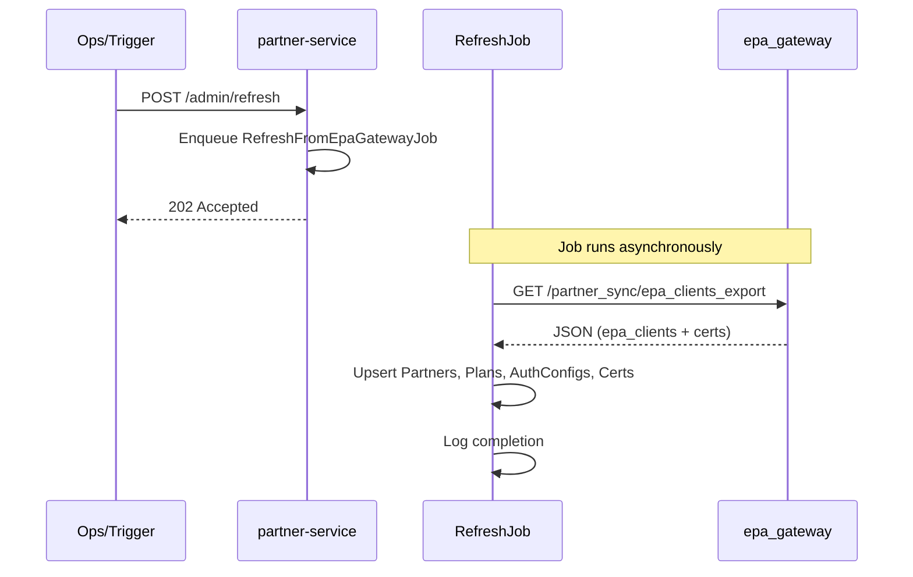

# Partner Service Refresh Sync Plan

## Architecture Overview




## Cards Summary


| #   | Card                                           | Est.     | Dependencies |
| --- | ---------------------------------------------- | -------- | ------------ |
| 1   | Add epa_clients export endpoint on epa_gateway | 1-2 days | None         |
| 2   | Add EpaGatewayClient for partner-service       | 1 day    | Card 1       |
| 3   | Add RefreshFromEpaGatewayJob                   | 2 days   | Card 2       |
| 4   | Add admin refresh endpoint on partner-service  | 1 day    | Card 3       |
| 5   | Configure queue adapter and job uniqueness     | 0.5 day  | Card 4       |


---

## Card 1: Add epa_clients export endpoint on epa_gateway

**Context / Why**

Partner-service needs a way to fetch all epa_clients (and client_certificates) from epa_gateway to perform refresh. Currently there is no bulk export endpoint; the admin index exists but uses epa-admin auth and may not be intended for partner-service.

**Scope**

- In scope: new `GET /partner_sync/epa_clients_export` endpoint (or under `epamotron` namespace if existing auth pattern fits); returns JSON with epa_clients array including nested client_certificates; basic auth or API key restricted to partner-service
- Out of scope: pagination (assume dataset fits in memory); version/plan_identifiers export

**Technical notes**

- Location: [epa_gateway/config/routes.rb](epa_gateway/config/routes.rb) - add route under `allow_apps` for partner-service
- Add `partner-service` (or `partner_sync`) to `get_creds` / settings if using basic auth
- Controller: new `PartnerSync::EpaClientsExportController` or `Epamotron::EpaClientsExportController`
- Response shape: `{ epa_clients: EpaClient.includes(:client_certificates).all.as_json }` - ensure `client_certificates` in `as_json` (already in [EpaClient#as_json](epa_gateway/app/models/epa_client.rb))
- Map epa_gateway `key` -> epa_type, `version` -> ncpdp_version; include `id` for plan_id alignment

**Acceptance criteria**

```gherkin
Feature: Partner sync epa_clients export

  Scenario: Successful export when authenticated as partner-service
    Given the request is authenticated with partner-service credentials
    When GET /partner_sync/epa_clients_export is called
    Then the response status is 200
    And the response body contains an "epa_clients" array
    And each epa_client has "key", "version", "id", "incoming_username", "outgoing_url", "client_certificates"

  Scenario: Export rejected when unauthenticated
    Given the request has no valid authentication
    When GET /partner_sync/epa_clients_export is called
    Then the response status is 401

  Scenario: Export rejected when authenticated as wrong app
    Given the request is authenticated with epa-admin credentials
    When GET /partner_sync/epa_clients_export is called
    Then the response status is 403 or 401 (depending on auth model)
```

**Definition of done**

- Code implemented and reviewed
- Acceptance criteria verified (request spec)
- Auth config added to settings.yml for partner-service

---

## Card 2: Add EpaGatewayClient for partner-service

**Context / Why**

Partner-service needs a centralized HTTP client to fetch the export from epa_gateway. This keeps the job logic clean and allows reuse/mocking in tests.

**Scope**

- In scope: `EpaGatewayClient` class in `lib/`; method `fetch_epa_clients_export` returning parsed JSON; config for epa_gateway base URL and credentials from Enviro/settings
- Out of scope: retry logic (can be in job); circuit breaker

**Technical notes**

- Location: [partner-service/lib/](partner-service/lib/) - new `epa_gateway_client.rb`
- Add `epa_gateway` or `services_mesh` config in [partner-service/config/settings.yml](partner-service/config/settings.yml) for URL and creds (mirror epa_gateway's `services_mesh` pattern)
- Use Faraday for HTTP; handle 4xx/5xx, timeout, connection errors

**Acceptance criteria**

```gherkin
Feature: EpaGatewayClient fetch export

  Scenario: Successful fetch when epa_gateway returns 200
    Given epa_gateway is configured with valid URL and credentials
    And epa_gateway returns 200 with valid JSON
    When fetch_epa_clients_export is called
    Then a hash with "epa_clients" key is returned
    And the hash is parsed JSON

  Scenario: Fetch raises when epa_gateway returns 401
    Given epa_gateway is configured
    And epa_gateway returns 401
    When fetch_epa_clients_export is called
    Then an error is raised (e.g. Unauthorized or custom)

  Scenario: Fetch raises when epa_gateway times out
    Given epa_gateway is configured
    And the request times out
    When fetch_epa_clients_export is called
    Then a timeout or connection error is raised
```

**Definition of done**

- Code implemented and reviewed
- Unit specs with Faraday stub
- Config documented in settings.yml

---

## Card 3: Add RefreshFromEpaGatewayJob

**Context / Why**

The refresh logic runs asynchronously so the endpoint returns quickly. The job fetches from epa_gateway and upserts partners, plans, auth_configs, and certificates into partner-service DB.

**Scope**

- In scope: `RefreshFromEpaGatewayJob` that calls `EpaGatewayClient#fetch_epa_clients_export`; upsert partners (from `get_partner_name`); upsert plans by epa_type; upsert auth_configs by plan_id; upsert incoming certificates; PaperTrail disabled during sync; error handling with retry or logging
- Out of scope: versions, plan_identifiers; full replace (delete records not in export); outgoing certificates

**Technical notes**

- Location: [partner-service/app/jobs/](partner-service/app/jobs/) - new `refresh_from_epa_gateway_job.rb`
- Reuse mapping logic from [lib/seeder.rb](partner-service/lib/seeder.rb): `create_auth_config` row mapping, `get_partner_name(epa_type)` (lines 362+)
- Consider extracting `EpaClientToPlanMapper` or similar to avoid duplicating Seeder logic
- Use `Plan.find_or_initialize_by(epa_type:)` and `update!`; same for AuthConfig
- Ensure `Partner` exists before creating Plan

**Acceptance criteria**

```gherkin
Feature: RefreshFromEpaGatewayJob syncs data

  Scenario: Job successfully upserts new plan from export
    Given partner-service has no plan with epa_type "Anthem_Example"
    And epa_gateway export contains an epa_client with key "Anthem_Example"
    When RefreshFromEpaGatewayJob is performed
    Then a Plan with epa_type "Anthem_Example" exists
    And an AuthConfig for that plan exists

  Scenario: Job updates existing plan when export has changed data
    Given partner-service has a plan with epa_type "Anthem_Example" and ncpdp_version "v2014041"
    And epa_gateway export has the same epa_client with ncpdp_version "v2017071"
    When RefreshFromEpaGatewayJob is performed
    Then the plan's ncpdp_version is "v2017071"

  Scenario: Job handles epa_gateway fetch failure
    Given epa_gateway returns 500
    When RefreshFromEpaGatewayJob is performed
    Then the job raises or retries (per retry_on config)
    And partner-service DB is unchanged

  Scenario: Job is idempotent
    Given epa_gateway export has 10 epa_clients
    When RefreshFromEpaGatewayJob is performed twice
    Then the second run does not create duplicate plans
    And the plan count is 10
```

**Definition of done**

- Code implemented and reviewed
- Job specs with mocked EpaGatewayClient
- Integration test with fixture or minimal DB (optional)

---

## Card 4: Add admin refresh endpoint on partner-service

**Context / Why**

Ops or automation needs a way to trigger the refresh when drift is detected. The endpoint enqueues the job and returns immediately.

**Scope**

- In scope: `POST /admin/refresh` (or `POST /sync`) that enqueues `RefreshFromEpaGatewayJob` and returns 202 Accepted with job_id if available; auth protected (API key or basic auth)
- Out of scope: status polling endpoint; sync status stored in DB

**Technical notes**

- Location: [partner-service/config/routes.rb](partner-service/config/routes.rb) - add route under admin namespace
- Controller: `Admin::RefreshController` or `SyncController` with `create` action
- Auth: use `before_action` with API key or BasicAuth; add partner-service-admin or similar to Enviro/settings
- Document in [partner-service/doc/openapi.yaml](partner-service/doc/openapi.yaml)

**Acceptance criteria**

```gherkin
Feature: Admin refresh endpoint

  Scenario: Successful job enqueue when authenticated
    Given the request has valid admin API key
    When POST /admin/refresh is called
    Then the response status is 202 Accepted
    And the response body indicates the job was enqueued
    And RefreshFromEpaGatewayJob has been enqueued

  Scenario: Refresh rejected when unauthenticated
    Given the request has no valid authentication
    When POST /admin/refresh is called
    Then the response status is 401

  Scenario: Refresh rejected when wrong API key
    Given the request has invalid API key
    When POST /admin/refresh is called
    Then the response status is 401
```

**Definition of done**

- Code implemented and reviewed
- Request spec for auth and 202 response
- OpenAPI updated

---

## Card 5: Configure queue adapter and job uniqueness

**Context / Why**

Partner-service uses ActiveJob with the default queue adapter. For production, a real queue (e.g. Sidekiq/Resque) must be configured. Also, preventing concurrent refresh runs avoids race conditions.

**Scope**

- In scope: configure `config.active_job.queue_adapter` and `queue_name_prefix` in production; add `unique_job` or `discard` if duplicate refresh enqueued (optional)
- Out of scope: full Sidekiq/Redis setup (assume infra exists)

**Technical notes**

- Location: [partner-service/config/environments/production.rb](partner-service/config/environments/production.rb) - uncomment lines 62-63
- If using solid_queue or sidekiq: add `unique until: :end` (or equivalent) to `RefreshFromEpaGatewayJob` to avoid overlapping runs

**Acceptance criteria**

```gherkin
Feature: Job queue configuration

  Scenario: Refresh job runs in production queue
    Given the environment is production
    And config.active_job.queue_adapter is set
    When POST /admin/refresh is called
    Then the job is enqueued to the configured queue
    And a worker can process the job

  Scenario: Duplicate refresh does not run concurrently (if uniqueness enabled)
    Given a refresh job is already running
    When POST /admin/refresh is called again
    Then the second job is discarded or queued after current completes
```

**Definition of done**

- Production config updated
- README or runbook updated with queue setup

---

## Testing Notes

- **Card 1:** epa_gateway request spec; stub EpaClient
- **Card 2:** partner-service unit spec; stub Faraday
- **Card 3:** job spec; stub EpaGatewayClient; use factory for Plan/Partner
- **Card 4:** partner-service request spec; stub job enqueue
- **Card 5:** manual or smoke test in staging

---

## Dependencies and Order

1. Card 1 (epa_gateway export) must be done first; partner-service cannot fetch without it
2. Card 2 (EpaGatewayClient) depends on Card 1 for contract
3. Card 3 (Job) depends on Card 2
4. Card 4 (Endpoint) depends on Card 3
5. Card 5 can be done in parallel with 4 or after

---

## Config Checklist


| Service         | Config                                    | Purpose                  |
| --------------- | ----------------------------------------- | ------------------------ |
| epa_gateway     | partner-service credentials in allow_apps | Auth for export endpoint |
| partner-service | epa_gateway URL + credentials             | EpaGatewayClient fetch   |
| partner-service | admin API key or basic auth               | Protect refresh endpoint |
| partner-service | queue adapter (Redis/Sidekiq)             | Production job execution |
